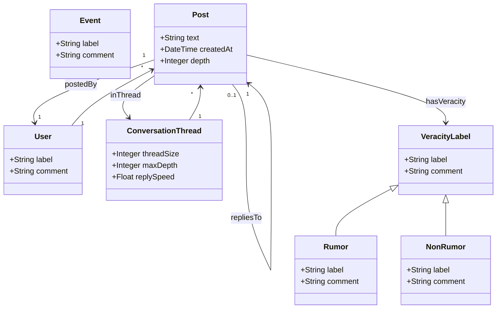

# PHEME Ontology - Class Diagram

```mermaid
classDiagram
    class Event {
        +String label
        +String comment
    }
    class Post {
        +String text
        +DateTime createdAt
        +Integer depth
    }
    class User {
        +String label
        +String comment
    }
    class ConversationThread {
        +Integer threadSize
        +Integer maxDepth
        +Float replySpeed
    }
    class VeracityLabel {
        +String label
        +String comment
    }
    class Rumor {
        +String label
        +String comment
    }
    class NonRumor {
        +String label
        +String comment
    }

    Post "1" --> "1" User : postedBy
    User "1" --> "*" Post
    Post "0..1" --> "1" Post : repliesTo
    ConversationThread "1" --> "*" Post
    Post --> ConversationThread : inThread
    Post --> VeracityLabel : hasVeracity
    VeracityLabel <|-- Rumor
    VeracityLabel <|-- NonRumor
```
