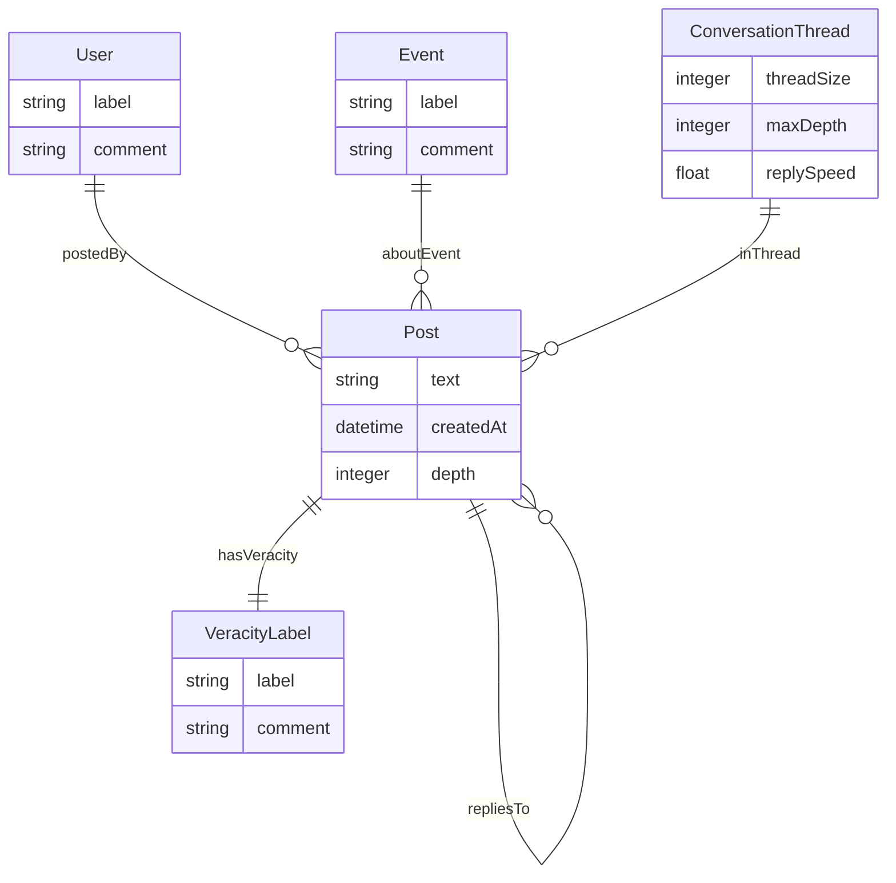

# PHEME Ontology - ER Diagram

```mermaid
erDiagram
    Event {
        string label
        string comment
    }
    User {
        string label
        string comment
    }
    Post {
        string text
        datetime createdAt
        integer depth
    }
    ConversationThread {
        integer threadSize
        integer maxDepth
        float replySpeed
    }
    VeracityLabel {
        string label
        string comment
    }

    User ||--o{ Post : postedBy
    Event ||--o{ Post : aboutEvent
    Post ||--o{ Post : repliesTo
    ConversationThread ||--o{ Post : inThread
    Post ||--|| VeracityLabel : hasVeracity
```
